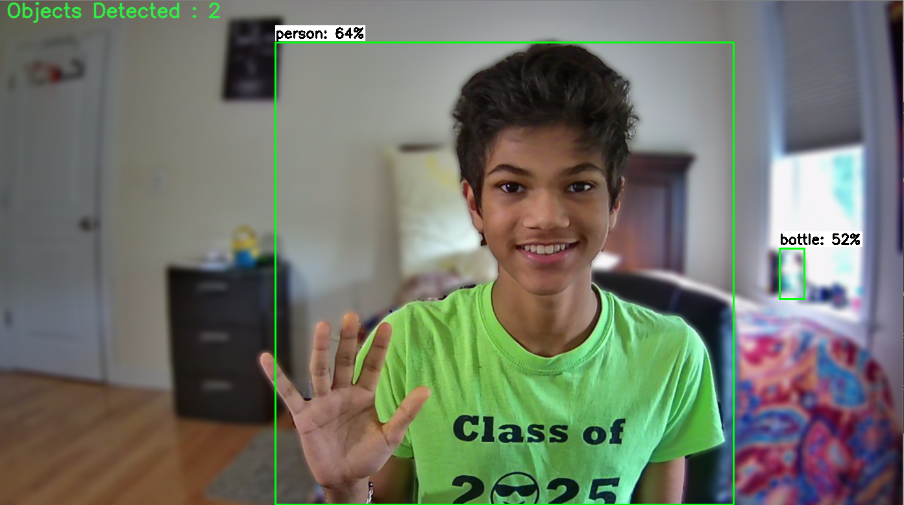
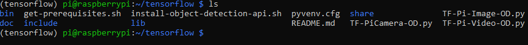
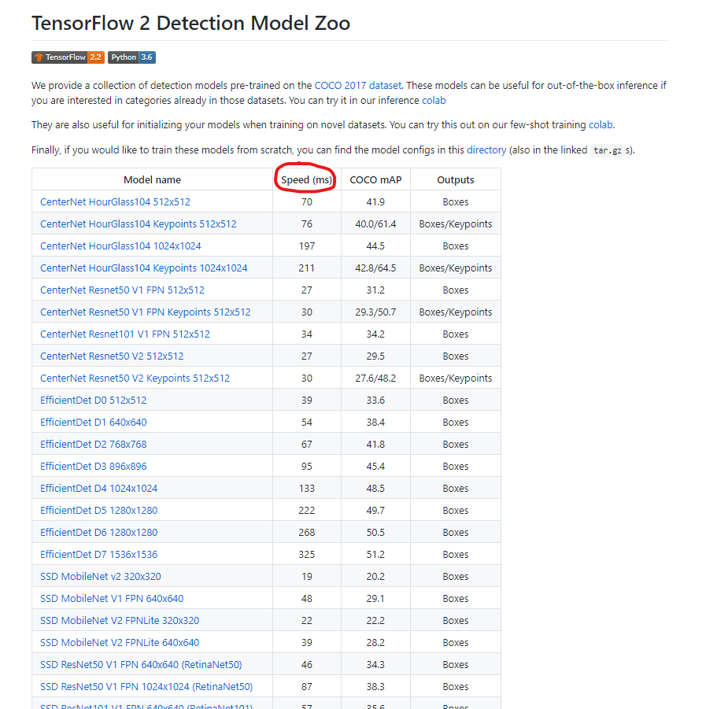

# Object-Detection-on-Raspberry-Pi
[](https://github.com/tensorflow/tensorflow/releases/tag/v2.2.0)
### This Tutorial Covers How to deploy the New TensorFlow 2 Object Detection Models and Custom Object Detection Models on the Raspberry Pi
<p align="center">
  
</p>

***Note: TensorFlow Lite is much more popular on smaller devices such as the Raspberry Pi, but with the recent release of the TensorFlow 2 Custom Object Detection API and TensorFlow saved_model format, TensorFlow Lite has become quite error-prone with these newer models. Upon testing, converted tflite models weren't very stable nor compatible with the tflite_runtime module. However, this is sure to change with time to come! So be sure to stay tuned and alert for new guides coming soon!***

## Introduction

Continuing with my tutorial on the TensorFlow 2 Object Detection API, what better way to deploy an Object Detection Model than on the Raspberry Pi? This guide will contain step-by-step instructions to do exactly so. To make everything as easy as possible for you guys, I have simplified all the commands into a few shellscripts compressing tons of commands into only a few! I've also provided three object detection scripts for images, video, and real-time object detection with the Pi Camera! Many thanks to my friend Gareth Bolton who helped me out with testing and refining my instructions!

**I will soon make a YouTube Tutorial which will be posted [here](), and an extremely import step [here](https://www.youtube.com/channel/UCT9t2Bug62RDUfSBcPt0Bzg?sub_confirmation=1)!**

## Table of Contents
1. [Setting up the Raspberry Pi and Getting Updates](https://github.com/armaanpriyadarshan/Object-Detection-on-Raspberry-Pi/blob/master/README.md#step-1-setting-up-the-raspberry-pi-and-getting-updates)
2. [Organizing our Workspace and Virtual Environment](https://github.com/armaanpriyadarshan/Object-Detection-on-Raspberry-Pi#step-2-organizing-our-workspace-and-virtual-environment)
3. [Installing TensorFlow, OpenCV, and other Prerequisites](https://github.com/armaanpriyadarshan/Object-Detection-on-Raspberry-Pi/blob/master/README.md#step-3-installing-tensorflow-opencv-and-other-prerequisites)
4. [Preparing our Object Detection Model]()
5. [Running Object Detection on Image, Video, or Pi Camera]()

## Step 1: Setting up the Raspberry Pi and Getting Updates
Before we can get started, we must have access to the Raspberry Pi's Desktop Interface. This can be done with VNC Viewer or the standard Monitor and HDMI. I made a more detailed video which can be found below

[](https://www.youtube.com/watch?v=jVzMRlCNO3U)

Once you have access to the Desktop Interface, either remote or physical, open up a terminal. Retrieve updates for the Raspberry Pi with

```
sudo apt-get update
sudo apt-get dist-upgrade
```

Depending on how recently you setup or updated your Pi, this can be instantaneous or lengthy. After your Raspberry Pi is up-to-date, we should make sure our Camera is enabled. First to open up the System Interface, use

```
sudo raspi-config
```

Then navigate to Interfacing Options -> Camera and make sure it is enabled. Then hit Finish and reboot if necessary.

<p align="left">
  
</p>

## Step 2: Organizing our Workspace and Virtual Environment

Then, your going to want to clone this repository with

```
git clone https://github.com/armaanpriyadarshan/Object-Detection-on-Raspberry-Pi.git
```

This name is a bit long so let's trim it down with

```
mv Object-Detection-on-Raspberry-Pi tensorflow
```

We are now going to create a Virtual Environment to avoid version conflicts with previously installed packages on the Raspberry Pi. First, let's install virtual env with

```
sudo pip3 install virtualenv
```

Now, we can create our ```tensorflow``` virtual environment with

```
python3 -m venv tensorflow
```

There should now be a ```bin``` folder inside of our ```tensorflow``` directory. So let's change directories with

```
cd tensorflow
```

We can then activate our Virtual Envvironment with

```
source bin/activate
```

**Note: Now that we have a virtual environment, everytime you start a new terminal, you will no longer be in the virtual environment. You can reactivate it manually or issue ```echo "source tensorflow/bin/activate" >> ~/.bashrc```. This basically activates our Virtual Environment as soon as we open a new terminal. You can tell if the Virtual Environment is active by the name showing up in parenthesis next to the working directory.**

When you issue ```ls```, your ```tensorflow``` directory should now look something like this

<p align="center">
  
</p>

## Step 3: Installing TensorFlow, OpenCV, and other Prerequisites
To make this step as user-friendly as possible, I condensed the installation process into 2 shell scripts. 

- ```get-prerequisites.sh```: This script installs OpenCV, TensorFlow 2.2.0, and matplotlib along with the dependencies for each module
- ```install-object-detection-api.sh```: This script clones the tensorflow/models repo, compiles the protos, and installs the Object Detection API through an Environment Variable

To install all the prerequisites needed, use

```
bash get-prequisites.sh
```
This took me around 5-10 minutes, so you can sit back and relax for a bit! Once finished running, the following message should be printed

```
Prequisites Downloaded Successfully
```

You can test your installation by entering

```
python
Python 3.7.3 (default, Jul 25 2020, 13:03:44)
[GCC 8.3.0] on linux
Type "help", "copyright", "credits" or "license" for more information.
>>> import tensorflow as tf
>>> print (tf.__version__)
```

If everything was installed properly, you should get ```2.2.0```. This means we can now setup the Object Detection API with

```
source ./install-object-detection-api.sh
```

You should a similar success message looking like this

```
TensorFlow Object Detection API Setup Successfully!
```

To test out this installation, another similar step looking like this

```
python
Python 3.7.3 (default, Jul 25 2020, 13:03:44)
[GCC 8.3.0] on linux
Type "help", "copyright", "credits" or "license" for more information.
>>> import object_detection
```

If everything went according to plan, the object_detection module should import without any errors.

**Note: Similar to the Virtual Environment, everytime you start a new terminal, the $PYTHONPATH variable set by the shell script will no longer be active. This means you will not be able to import the object_detection module. You can reactivate it manually with ```export PYTHONPATH=$PYTHONPATH:/home/pi/tensorflow/models/research:/home/pi/tensorflow/models/research/slim``` everytime you open a new terminal or issue echo ```"export PYTHONPATH=$PYTHONPATH:/home/pi/tensorflow/models/research:/home/pi/tensorflow/models/research/slim" >> ~/.bashrc```. This sets the system variable upon opening a new terminal.**

## Step 4: Preparing our Object Detection Model

For this step, there are two options. You can use one of the TensorFlow Pre-Trained Object Detection Models which can be found in the [TensorFlow 2 Model Zoo](https://github.com/tensorflow/models/blob/master/research/object_detection/g3doc/tf2_detection_zoo.md). Or you can train your own Custom Object Detector with the TensorFlow 2 Custom Object Detection API. Later on, I will cover both of these options a bit more extensively. First let's create a directory to store our models. Since we already have a folder named ```models```, let's call it ```od-models```.

```
mkdir od-models
```

Then let's cd into it with

```
cd od-models
```

Now, let's cover both options with more detail.

### Option 1: Using a TensorFlow 2 Pre-Trained Model
For this guide, I will be using this option. TensorFlow's pre-trained models are trained on the [MSCOCO Dataset](https://cocodataset.org/#home) containing a variety of common, everyday, objects. TensorFlow 2's new ```saved_model``` format consists of a ```saved_model.pb``` and a ```variables``` directory. These two hold weights and the actual inference graph for object detection. The TensorFlow 2 Model Zoo can be found [here](https://github.com/tensorflow/models/blob/master/research/object_detection/g3doc/tf2_detection_zoo.md).
<p align="left">
  
</p>
